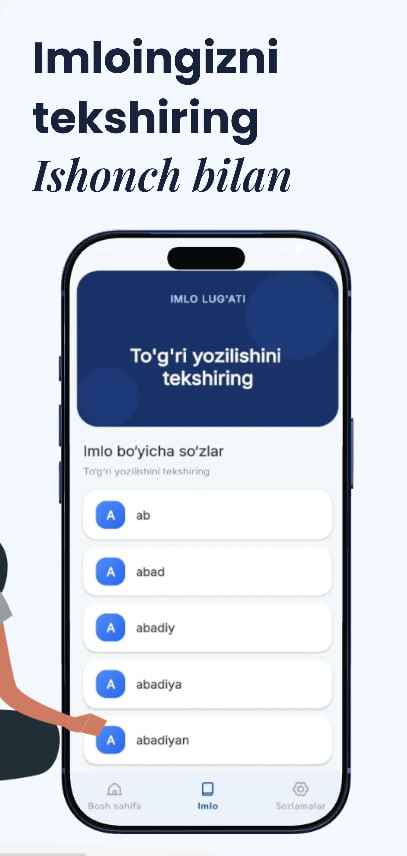
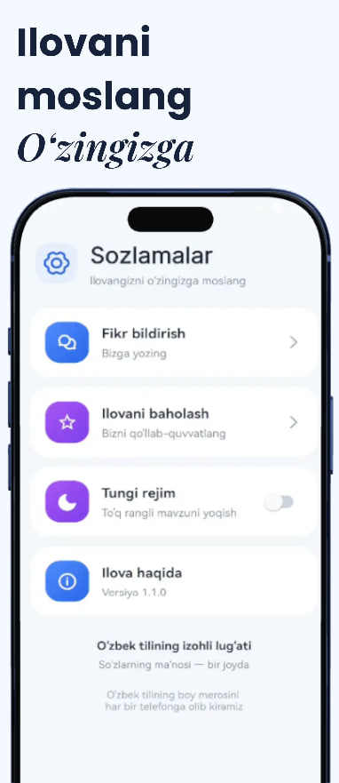
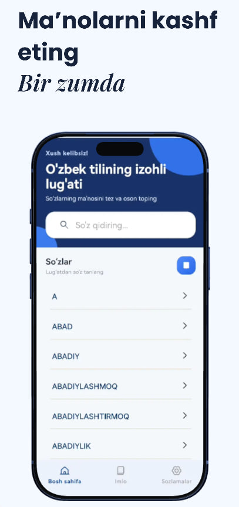

# O'zbek tilining izohli lug'ati 📖

O'zbek tilidagi so'zlarning ma'nosini tez va oson topish, imlo (to'g'ri yozilishini tekshirish) va boshqa foydali funksiyalarni bir joyga jamlagan Android ilova.

## ✨ Asosiy imkoniyatlar

- 🔍 **So'z qidirish** — lug'atdagi minglab so'zlar orasidan kerakli so'zni tezda toping
- ✏️ **Imlo lug'ati** — so'zning to'g'ri yozilishini ishonch bilan tekshiring
- 📚 **Alifbo bo'yicha ro'yxat** — so'zlarni harflar bo'yicha ko'rib chiqing (A, ABAD, ABADIY va h.k.)
- 🌙 **Tungi rejim** — ko'zga yoqimli, to'q rangli mavzu
- ⭐ **Ilovani baholash va fikr bildirish** — ilova ichidan to'g'ridan-to'g'ri fikr qoldirish imkoniyati
- 📱 **Oflayn ishlash** — internet aloqasisiz ham lug'atdan foydalanish

## 📸 Skrinshotlar

<p align="center">
  
  
  
  
</p>


## 🛠 Texnologiyalar

- **Til:** Kotlin
- **Ma'lumotlar bazasi:** Room
- **Asinxron ishlov:** Coroutines, Flow
- **UI:** Jetpack Compose / XML (loyihangizga mos ravishda tanlang)
- **Dependency Injection:** Dagger Hilt

> Yuqoridagi ro'yxatni loyihangizda haqiqatda ishlatilgan kutubxonalarga qarab tahrirlang — men buni sizning umumiy tajribangiz asosida taxminiy tarzda kiritdim, chunki yuklangan zip-fayl qirqilib qolgani sabab loyiha kodini o'qiy olmadim.

## 🚀 O'rnatish

```bash
git clone https://github.com/shahzoddev777/<repo-nomi>.git
```

1. Loyihani Android Studio'da oching
2. Gradle sinxronizatsiyasi tugashini kuting
3. Ilovani emulyator yoki real qurilmada ishga tushiring (`Run ▶`)

## 📋 Talablar

- Android Studio (so'nggi versiya)
- Minimum SDK: `21` (moslang)
- Kotlin `1.9+`

## 👤 Muallif

**Shahzod Reyimboyev**
- GitHub: [@shahzoddev777](https://github.com/shahzoddev777)
- Telegram: [@Shahzodbek_reyimboyev](https://t.me/Shahzodbek_reyimboyev)
- LinkedIn: [shahzodbek-reyimboyev](https://www.linkedin.com/in/shahzodbek-reyimboyev-206a05427)

## 📄 Litsenziya

Ushbu loyiha shaxsiy portfolio maqsadida yaratilgan. Litsenziya turini xohishingizga qarab qo'shishingiz mumkin (masalan, MIT).
